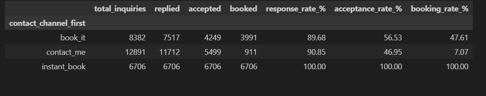
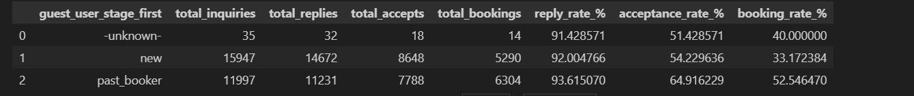
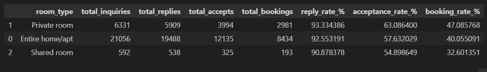
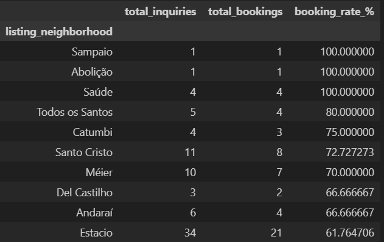
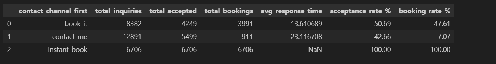
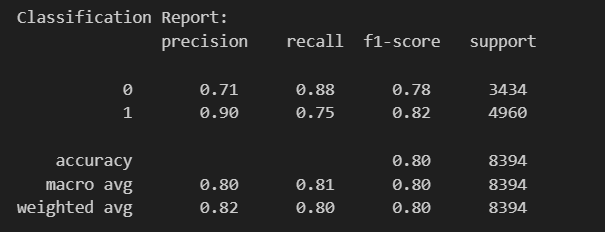
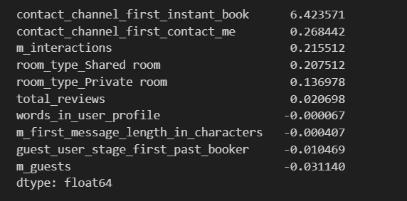
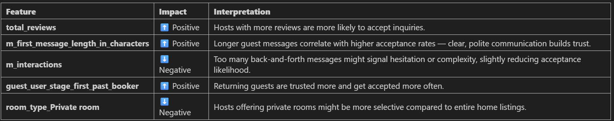
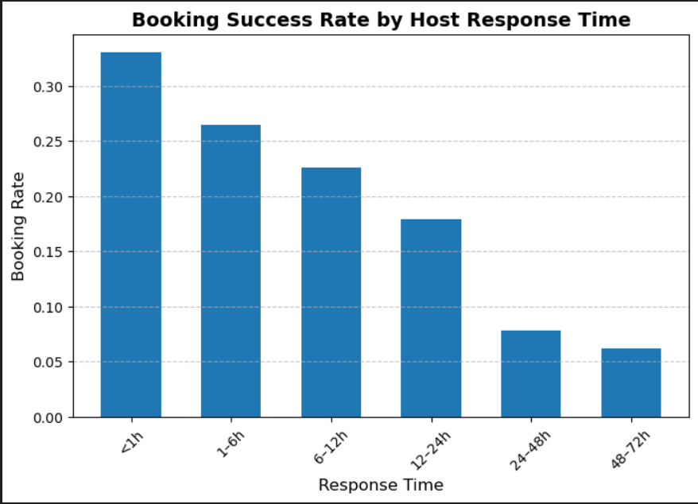
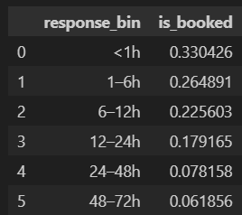

# 🧠 Airbnb Rio de Janeiro – Guest–Host Matching & Booking Growth Analysis

## 📋 Project Overview

You are the **first data scientist** to join a cross-functional **Product and Operations team** working to **grow bookings in Rio de Janeiro**.  
The team seeks your help in understanding and improving the **guest–host matching process**, **booking conversions**, and **strategic initiatives** to drive success.

---

## ❓ Questions & Objectives

### **1️⃣ What key metrics would you propose to monitor over time the success of the team's efforts in improving the guest–host matching process, and why?**  
Clearly define your metric(s) and explain how each is computed.

### **2️⃣ What areas should we invest in to increase the number of successful bookings in Rio de Janeiro?**  
What segments are doing well and what could be improved?  
Propose **2–3 specific recommendations** (business initiatives and product changes) that could address these opportunities.  
Demonstrate rationale behind each recommendation **and prioritize them** in order of their estimated impact.

### **3️⃣ What additional research, experiments, or approaches could help Airbnb get more clarity on the broader challenge of matching supply and demand?**  
Think beyond the provided data.

---

## 🧮 Tools & Techniques Used

- **Python (Pandas, NumPy, Scikit-learn)** – Data cleaning, feature engineering, and modeling  
- **SQL** – Data extraction and aggregation  
- **Tableau / Power BI** – Visualization and funnel analysis  
- **Logistic Regression** – Predictive modeling for host acceptance  
- **A/B Testing** – Experimental validation  
- **Matplotlib / Seaborn** – Exploratory Data Analysis (EDA)  

---

## 1️⃣ Key Metrics to Monitor Guest–Host Matching Success

### **📊 Core Funnel Metrics**

| Metric | Definition | Formula | Why It Matters |
|--------|-------------|----------|----------------|
| **Inquiry-to-Acceptance Rate** | % of guest inquiries accepted by hosts | `Accepted Inquiries / Total Inquiries` | Measures the effectiveness of host–guest matching |
| **Acceptance-to-Booking Rate** | % of accepted inquiries that turn into confirmed bookings | `Confirmed Bookings / Accepted Inquiries` | Tracks how well accepted matches convert to revenue |
| **Overall Booking Conversion Rate** | % of total inquiries that become confirmed bookings | `Confirmed Bookings / Total Inquiries` | Core KPI for success of the matching and booking funnel |
| **Average Host Response Time** | Time (in hours) from inquiry to host response | `Avg(Time_to_First_Response)` | Indicates communication speed and guest experience quality |
| **Instant Book Adoption Rate** | % of listings using Instant Book | `Instant_Book_Listings / Total_Listings` | Proxy for frictionless bookings and guest trust |
| **Cancellation Rate** | % of bookings canceled by hosts or guests | `Canceled_Bookings / Confirmed_Bookings` | Helps monitor reliability and trust on the platform |

---

## 2️⃣ Areas for Investment & Strategic Recommendations

### **Segment Analysis**

  
  
  

---

## **Strategic Recommendations to Improve Bookings**

### 🥇 **Recommendation 1 — Expand and Promote “Instant Book” Adoption (Highest Impact)**

**Observation:**  
“Instant Book” listings show **100% booking conversion**, but represent only a fraction of total listings.

**Rationale:**  
Removing host approval friction improves conversion and user experience.

**Actionable Initiatives:**
- Encourage hosts to opt in to **Instant Book** via temporary fee reductions or ranking boosts.  
- Educate hosts about **safety features** (guest verification, profile checks).  

**Expected Impact:**  
Higher booking completion rates and faster guest–host matching.

---

### 🥈 **Recommendation 2 — Build Trust and Ease for New Guests**

**Observation:**  
**New users** show **lower acceptance (54%)** and **booking (33%)** rates than returning users.

**Rationale:**  
Hosts hesitate to accept unverified or first-time guests.

**Actionable Initiatives:**
- Add **trust-building badges** (verified ID, reviews from external platforms).  
- Offer **first-stay discounts** or “guest assurance” guarantees.  

**Expected Impact:**  
Improved host acceptance rates and higher first-time booking conversions.

---

### 🥉 **Recommendation 3 — Optimize Room-Type and Neighborhood Mix**

**Observation:**  
**Private rooms** convert best (~47%), while **shared rooms** lag (~33%).  
Certain neighborhoods show strong demand but **low supply**.

**Rationale:**  
Better alignment of supply and demand can boost bookings.

**Actionable Initiatives:**
- Recruit new hosts in **high-demand neighborhoods** (e.g., *Estácio, Méier*).  
- Provide **dynamic pricing tools** for shared-room hosts.  

**Expected Impact:**  
Improved conversion rates and balanced supply–demand distribution.

---

## 3️⃣ Broader Research & Experimentation

### **Experiment 1: Instant Book Impact (A/B Test)**

**Insights:**
- Instant Book listings bypass host acceptance → **100% acceptance & booking rate**.  
- Average response time = 0 (automated).  
- Manual channels like *Book_it* outperform *Contact_me*.  
- Long response times correlate with poor conversion.

**Business Recommendations:**
- Promote **Instant Book** listings platform-wide.  
- Incentivize hosts to switch from *Contact_me* → *Book_it*.  
- Improve *Contact_me* workflow with reminders or incentives for faster responses.  
- Add search filters or ranking boosts for **Instant Book** listings.

---

### **Experiment 2: Predicting Acceptance Probability (Guest–Host Matching Model)**

  
  

#### **Model Overview**
A **Logistic Regression** model was trained using behavioral and contextual features:

- `m_guests` — Number of guests in inquiry  
- `m_interactions` — Number of interactions between host and guest  
- `m_first_message_length_in_characters` — Length of guest’s first message  
- `total_reviews` — Number of listing reviews  
- `words_in_user_profile` — Words in guest profile  
- Encoded variables: `contact_channel_first`, `guest_user_stage_first`, `room_type`  
- **Target:** `is_accepted` (1 = accepted, 0 = rejected)

#### **📈 Model Performance**

| Metric | Score | Interpretation |
|---------|--------|----------------|
| Accuracy | 0.803 | Model correctly predicts ~80% of inquiries |
| ROC–AUC | 0.902 | Excellent distinction between accepted vs. rejected inquiries |
| Precision (Accepted) | 0.90 | 90% of positive predictions are correct |
| Recall (Accepted) | 0.75 | Captures 75% of true accepted cases |
| F1-Score (Accepted) | 0.82 | Balanced precision and recall |

#### **🔍 Key Feature Insights**

| Feature | Impact | Interpretation |
|----------|---------|----------------|
| **total_reviews** | ⬆️ Positive | Listings with more reviews → higher acceptance likelihood |
| **m_first_message_length_in_characters** | ⬆️ Positive | Longer, clearer guest messages build trust |
| **m_interactions** | ⬇️ Negative | Too many back-and-forth messages → hesitation or complexity |
| **guest_user_stage_first_past_booker** | ⬆️ Positive | Returning guests are trusted more |
| **room_type_Private room** | ⬇️ Negative | Private room hosts may be more selective |

#### **💡 Business Takeaways**
- Use model scores to **rank inquiries by acceptance likelihood**.  
- Nudge guests to write **longer, more detailed messages**.  
- Focus on **returning guests** and **well-reviewed listings** to drive conversions.  
- Integrate predictions into **search ranking** and **guest education prompts**.

---

### **Experiment 3: Response Time vs. Booking Success**

  

#### **Objective**
Analyze how host **response speed** affects **booking success**.

#### **Findings**
- Faster responses → higher booking rates.  
- Hosts replying within **1 hour** have the highest conversion.  
- Booking probability drops sharply after **12–24 hours**.  

#### **Interpretation**
Speed of response builds guest trust and prevents churn to competitors.

#### **🚀 Business Recommendations**
- **Host Response Time Badges:** e.g., “Replies within 1 hour.”  
- **Automated Reminders or AI Smart Replies:** Encourage faster communication.  
- **Ranking Boosts:** Reward hosts with consistently quick responses.

---

## 🧭 Summary of Insights

| Focus Area | Key Finding | Recommended Action |
|-------------|--------------|--------------------|
| Guest–Host Matching | Instant Book eliminates friction | Expand Instant Book adoption |
| New User Experience | First-time guests face trust barriers | Add verification & first-stay incentives |
| Supply–Demand Imbalance | Some neighborhoods under-supplied | Recruit hosts in high-demand zones |
| Host Responsiveness | Faster responses → higher bookings | Incentivize quick replies & badge system |

---

## 🧰 Deliverables

- Funnel conversion dashboards (Power BI / Tableau)  
- Predictive acceptance model (Python, Scikit-learn)  
- Segmentation analysis (SQL)  
- A/B test design framework  
- README summary (this document)

---

## 💬 Conclusion

Improving **guest–host matching** in Rio de Janeiro requires both **data-driven modeling** and **behavioral nudges**.  
Key levers such as **Instant Book**, **trust features for new guests**, and **response-time optimization** can substantially boost bookings and platform efficiency.

---

**Author:** *[MOHAMMAD ADIL]*  
**Role:** Data Scientist – Product & Operations (Rio de Janeiro Growth Project)  
**Tools:** Python • SQL  • Scikit-learn • Power BI  
**Date:** November 2025
